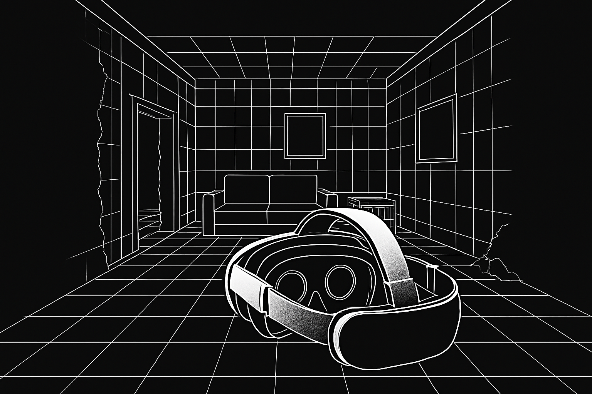

# Meta Quest 3D Reconstruction

<p align="center">
  
</p>

**A project for reconstructing 3D scenes using image and depth data captured via the [Quest Reality Capture (QRC)](https://github.com/t-34400/QuestRealityCapture/) application.**

---

## 🧭 Overview

This project converts image and depth data captured on Meta Quest (via a custom Reality Capture app) into formats suitable for 3D reconstruction using Open3D or COLMAP.

---

## 🚀 Setup

### Requirements

* Open3D
* NumPy
* SciPy
* Pillow
* OpenCV
* PyTorch

---

## 🔧 Processing Pipeline

### 1. Convert passthrough YUV images to RGB

```bash
python scripts/convert_yuv_to_rgb.py \
  --project_dir path/to/your/project
```

**Required:**

* `--project_dir` (`-p`): Path to the directory containing QRC-generated directory.

**Optional:**

* `--filter`: Enable image quality filtering (default: disabled).
* `--blur_threshold`: Threshold for blur detection using Laplacian variance (default: 50.0).
* `--exposure_threshold_low`: Underexposure detection threshold (default: 0.1).
* `--exposure_threshold_high`: Overexposure detection threshold (default: 0.1).

---

### 2. Convert raw depth to linear depth map (Optional)

This step is not required for the subsequent processing and can be skipped if not needed.

```bash
python scripts/convert_depth_to_linear_map.py \
  --project_dir path/to/your/project
```

**Required:**

* `--project_dir` (`-p`): Path to the directory containing QRC-generated directory.

**Optional:**

* `--near`: Near clipping plane distance in meters (default: 0.1).
* `--far`: Far clipping plane distance in meters (default: 10.0).

---

### 3. Generate 3D point cloud via TSDF (Open3D)

```bash
python scripts/generate_point_cloud.py \
  --project_dir path/to/your/project \
  --color \
  --visualize
```

**Required:**

* `--project_dir` (`-p`): Path to the directory containing QRC-generated directory.

**Optional:**

* `--voxel_length`: TSDF voxel size in meters (default: 0.01).
* `--sdf_trunc`: Truncation distance in meters (default: 0.04).
* `--color`: Generate colored point cloud using RGB images.
* `--visualize`: Display the reconstructed TSDF volume in an Open3D viewer.

---

### 4. Create a COLMAP Project

Generate a COLMAP-compatible project from your data.

```bash
python scripts/build_colmap_projet.py \
  --project_dir path/to/your/project \
  --output_dir path/to/output/colmap_project
```

**Required:**

* `--project_dir` (`-p`): Path to the project directory containing QRC data.
* `--output_dir` (`-o`): Directory to output the COLMAP project files.

**Optional:**

* `--interval`: Interval for processing images (default: 5).

---

## 📝 License

This project is licensed under the MIT License.
See the [LICENSE](LICENSE) file for full license text.

---

## 🧩 Third-Party Code
This repository includes components from the [COLMAP](https://github.com/colmap/colmap) project,
originally developed at ETH Zurich and UNC Chapel Hill, and distributed under the 3-clause BSD license.
See [`scripts/third_party/colmap/COPYING.txt`](./scripts/third_party/colmap/COPYING.txt) for details.

---

## 📌 TODO

* [ ] Convert to RGB-D dataset formats
